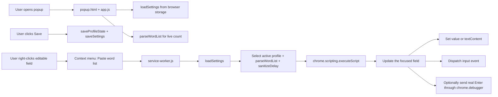

# Multi-Line Auto Typer

> Insert entries from selectable profiles into focused editable fields with optional Enter presses and a context-menu workflow.

[](https://chromewebstore.google.com/search/OstinUA)
[](https://ostinua.github.io/Chrome-Web-Store_Developer-List/)

[](manifest.json)
[](manifest.json)
[](LICENSE)
[](#testing)
[](#testing)

> [!NOTE]
> This repository is a browser extension (Chrome Manifest V3), not a backend package manager artifact. Installation is performed via loading an unpacked extension.

## Table of Contents

- [Features](#features)
- [Tech Stack & Architecture](#tech-stack--architecture)
  - [Project Structure](#project-structure)
  - [Key Design Decisions](#key-design-decisions)
- [Getting Started](#getting-started)
  - [Prerequisites](#prerequisites)
  - [Installation](#installation)
- [Testing](#testing)
- [Deployment](#deployment)
- [Usage](#usage)
- [Configuration](#configuration)
- [License](#license)
- [Contacts & Community Support](#contacts--community-support)

## Features

- Context-menu driven insertion (`Paste word list`) for any focused editable target.
- Create, rename, duplicate, delete, and switch between word-list profiles.
- Choose whether to press Enter after each entry. With Enter disabled, the list is inserted together (newlines in multiline fields, spaces in a single-line input).
- Supports both `input` / `textarea` elements and `contenteditable` containers.
- Configurable pauses between entries and before Enter (`0..5000 ms`).
- Automatic trimming, blank-line elimination, and optional duplicate suppression.
- Real-time item count preview in popup UI before execution.
- Theme-aware popup with persisted dark/light preference.
- Profiles are stored in `chrome.storage.local`; preferences are synchronized with `chrome.storage.sync`.
- The previous `customWordList` value is copied into the default profile on first launch.
- Explicit defaults and hard cap protection (`maxEntries = 2000`) to avoid runaway payloads.
- MV3-compliant architecture with background service worker and module-based shared logic.

> [!IMPORTANT]
> When Enter is enabled, the extension briefly attaches the Chrome debugger and sends real Enter key events through the DevTools Protocol. Chrome may show a debugging notice while the list is running. Some sites may still process input differently, so test on the target field first.

## Tech Stack & Architecture

### Core Stack

- Language: Vanilla JavaScript (ES Modules)
- Runtime Target: Chrome Extension Manifest V3
- Browser APIs: `chrome.contextMenus`, `chrome.scripting`, `chrome.debugger`, `chrome.storage.local`, `chrome.storage.sync`, `chrome.runtime`
- UI: Native HTML + CSS popup (`popup.html`, `styles/popup.css`)
- Packaging: Unpacked extension directory (no bundler required)

### Project Structure

<details>
<summary>Expand complete repository tree</summary>

```text
multi-line-auto-typer/
├── icons/
│   └── icon128.png
├── src/
│   ├── background/
│   │   └── service-worker.js
│   ├── popup/
│   │   └── app.js
│   └── shared/
│       ├── constants.js
│       ├── list.js
│       └── storage.js
├── styles/
│   └── popup.css
├── LICENSE
├── manifest.json
└── popup.html
```

</details>

### Key Design Decisions

- Shared pure utility modules (`src/shared`) isolate parsing, delay sanitization, and storage contracts.
- Background service worker owns event orchestration and script injection boundary.
- Popup remains stateful-but-thin: user input and preference editing only.
- Delay and list parsing are normalized before persistence and execution for consistency.
- Conservative failure model (`try/catch` around injection trigger) avoids hard extension crashes.

<details>
<summary>Architecture and event-flow diagram</summary>



</details>

## Getting Started

### Prerequisites

- Google Chrome (or Chromium-compatible browser with MV3 support).
- Local clone of this repository.
- Developer mode access in `chrome://extensions`.

### Installation

1. Clone the repository:

   ```bash
   git clone https://github.com/<your-org>/multi-line-auto-typer.git
   cd multi-line-auto-typer
   ```

2. Open Chrome Extensions page:

   ```text
   chrome://extensions
   ```

3. Enable **Developer mode** (top-right toggle).
4. Click **Load unpacked**.
5. Select the repository root directory.
6. Pin the extension and open popup to configure entries.

> [!TIP]
> Keep one item per line in the popup list. Empty lines are ignored automatically.

<details>
<summary>Troubleshooting and alternative installation notes</summary>

### Common issues

- **Context menu item not visible**
  - Refresh the page where you right-clicked.
  - Ensure you right-click directly in an editable input area.
  - Reload extension from `chrome://extensions`.

- **Nothing inserted after click**
  - Verify the target field had focus before opening context menu.
  - Some web apps block synthetic events; test against a plain HTML form first.

- **Settings not retained**
  - Confirm browser sync storage is available and not disabled by policy/profile restrictions.

### Build-from-source note

No transpilation/build pipeline is required. The repository is source-of-truth and loadable as-is.

</details>

## Testing

Run the built-in Node tests and syntax checks:

```bash
# Syntax-check JavaScript modules with Node.js
node --check src/background/service-worker.js
node --check src/popup/app.js
node --check src/shared/list.js
node --check src/shared/storage.js
node --check src/shared/constants.js
node --test tests/extension.test.mjs

# Manual extension validation checklist
# 1) Load unpacked extension
# 2) Save settings in popup
# 3) Right-click editable field and run "Paste word list"
# 4) Verify profile selection, Enter, delay, and duplicate behavior
```

> [!NOTE]
> The automated tests use mocked Chrome APIs. The Google Play Console email field still needs a manual browser check because its event handling is outside this repository.

## Deployment

For browser extensions, “deployment” means packaging and publishing to an extension store:

1. Validate extension behavior on representative target pages.
2. Increment `version` in `manifest.json`.
3. Create release archive:

   ```bash
   zip -r multi-line-auto-typer.zip . -x '*.git*' -x 'node_modules/*'
   ```

4. Upload package to Chrome Web Store Developer Dashboard.
5. Complete listing metadata, screenshots, and policy declarations.
6. Submit for review and publish.

<details>
<summary>CI/CD guidance for extension repositories</summary>

Suggested pipeline stages:

1. **Static checks**: JS syntax + lint.
2. **Contract tests**: pure helpers (`list.js`, `storage.js`) via Node test runner.
3. **Artifact build**: deterministic ZIP packaging.
4. **Release gating**: tag-based publish job and changelog validation.

Example release trigger strategy:

- `main` push: run checks only.
- `v*` tag: run checks + generate distributable ZIP artifact.

</details>

## Usage

### Basic Usage

1. Open extension popup.
2. Paste newline-separated entries.
3. Create or select a profile, then enter one item per line.
4. Configure `Delay between entries (ms)`, `Wait before Enter (ms)`, `Skip duplicate lines`, and `Press Enter after each entry`.
5. Click `Save changes`. Switching profiles also saves the current profile.
6. Focus an editable field on any webpage.
7. Right-click and choose `Paste word list`.

```text
Example list input:
apple
banana
banana
cherry
```

With `Skip duplicate lines = true`, output sequence becomes: `apple`, `banana`, `cherry`.

```js
// Conceptual pipeline used internally (simplified)
const settings = await loadSettings();
const activeProfile = settings.profiles.find((profile) => profile.id === settings.activeProfileId);
const words = parseWordList(activeProfile?.wordList, {
  skipDuplicates: settings.skipDuplicates
});
const delayMs = sanitizeDelay(settings.insertionDelayMs);
const enterDelayMs = sanitizeDelay(settings.enterDelayMs, 100);
await insertWords(tabId, frameId, words, delayMs, enterDelayMs, settings.pressEnter);
```

<details>
<summary>Advanced Usage: behavior contracts, custom formatting strategy, and edge cases</summary>

### Advanced behavior contracts

- Insertion loop dispatches:
  - `InputEvent("input")` after each value assignment.
  - Chrome DevTools Protocol `Input.dispatchKeyEvent` for Enter, when enabled.
- Works with:
  - `HTMLInputElement`
  - `HTMLTextAreaElement`
  - `HTMLElement.isContentEditable === true`

### Custom formatter pattern

If you fork this project, add pre-processing before `parseWordList`:

```js
const preprocess = (line) => line.replace(/\s+/g, " ").trim();
const cleaned = rawText
  .split(/\r?\n/)
  .map(preprocess)
  .filter(Boolean)
  .join("\n");
const words = parseWordList(cleaned, { skipDuplicates: true });
```

### Edge cases

- Duplicate detection is case-sensitive (`Apple` != `apple`).
- `maxEntries` truncates overflow silently to maintain bounded execution.
- Delay values outside numeric range revert/clamp via `sanitizeDelay`.
- Certain rich editors may intercept Enter and transform behavior (e.g., send message instead of newline).
- Chrome displays a debugger notice while Enter-enabled insertion is in progress.

> [!CAUTION]
> Do not use this tool to automate interactions that violate site Terms of Service or platform anti-abuse policies.

</details>

## Configuration

Profiles and the active profile ID are stored in `chrome.storage.local`. Other preferences use `chrome.storage.sync`.

| Key | Type | Default | Description |
| --- | --- | --- | --- |
| `profileState` (local) | `object` | Default profile | Profiles, their raw lists, and the active profile ID. |
| `theme` | `"dark" \| "light"` | `"dark"` | Popup visual theme. |
| `insertionDelayMs` | `number` | `40` | Delay between insertions; sanitized/clamped to `0..5000`. |
| `enterDelayMs` | `number` | `100` | Pause after each item before pressing Enter; sanitized/clamped to `0..5000`. |
| `skipDuplicates` | `boolean` | `false` | Enables first-occurrence deduplication when parsing list. |
| `pressEnter` | `boolean` | `true` | Sends Enter after each entry. |

> [!NOTE]
> Existing `customWordList` sync data is imported into the default local profile once. Profile lists are local to each browser installation.

<details>
<summary>Exhaustive configuration schema and defaults</summary>

```json
{
  "storageKeys": {
    "profileState": "profileState",
    "theme": "theme",
    "insertionDelayMs": "insertionDelayMs",
    "enterDelayMs": "enterDelayMs",
    "skipDuplicates": "skipDuplicates",
    "pressEnter": "pressEnter"
  },
  "defaults": {
    "theme": "dark",
    "insertionDelayMs": 40,
    "enterDelayMs": 100,
    "skipDuplicates": false,
    "pressEnter": true,
    "maxEntries": 2000
  },
  "constraints": {
    "insertionDelayMs": {
      "min": 0,
      "max": 5000,
      "rounding": "nearest integer",
      "fallbackOnInvalid": 40
    },
    "enterDelayMs": {
      "min": 0,
      "max": 5000,
      "rounding": "nearest integer",
      "fallbackOnInvalid": 100
    },
    "profileWordList": {
      "trimLines": true,
      "dropEmptyLines": true,
      "deduplicate": "optional",
      "maxEntries": 2000
    }
  }
}
```

</details>

## License

This project is licensed under the GNU General Public License v3.0. See [`LICENSE`](LICENSE) for full legal text.

## Contacts & Community Support

## Support the Project

[](https://www.patreon.com/OstinFCT)
[](https://ko-fi.com/fctostin)
[](https://boosty.to/ostinfct)
[](https://www.youtube.com/@FCT-Ostin)
[](https://t.me/FCTostin)

If you find this tool useful, consider leaving a star on GitHub or supporting the author directly.
